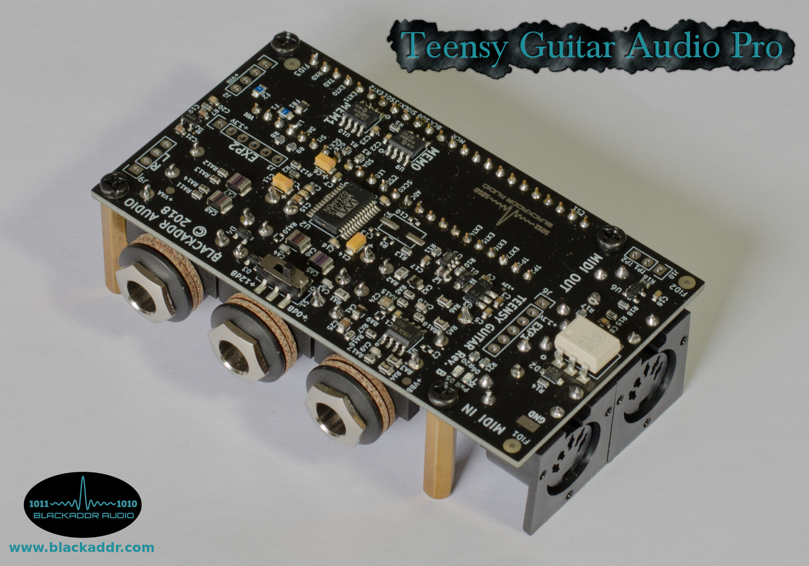

## BALibrary
This library is under active development as of 2020.

Last tested with:
Arduino IDE: v1.8.10
Teensyduino: v1.48*

*The Arduino MIDI library has recently undergone changes to it's interface. You must have Teensyduino v1.48 or higher for the library and it's examples to work correctly.

**INTRODUCTION**
This open-source library is designed to extend the capabilities of Teensyduino, a collection of Arudino libraries  ported to the Teensy microcontroller platform by Paul at PJRC.com.

Teensyduino provides a realtime Audio library that makes it very easy for musicians and audio enthusiasts to start experimenting with and writing their own audio processors and effects, without the need for a lot of programming experience. This is accomplished by handling the complex topics (like using DMA to move audio blocks around) so you can focus on how you want to process the audio content itself.

BALibrary adds to this by providing features and building blocks that are of particular interest to guitarists. In a nutshell, guitarists want digital audio to work similar to their guitar pedals and amps. Basically, a chain of self-contained audio processors with switches and knobs to control them. The good news is we can do this digitally with virtual patch cables (called AudioConnections) and MIDI control.

**INSTALLATION**
In order to use BALibrary, you should:

 1. Install the Arduino IDE. This is where you write and compile your software, called 'sketches'. See [here](https://www.arduino.cc/en/Main/Software).
 2. Install the Teensyduino plugin for the Arduino IDE. This provides support for programming Teensy boards over USB, as well as access to the plethora of helpful libraries and examples it provides. See [here](https://www.pjrc.com/teensy/td_download.html).
 3. Download the BALibrary library, and use the Library Manager in the Arduino IDE to install it. See [here](https://www.arduino.cc/en/Guide/Libraries) for details..
 4. Include "BALibrary.h" for access to general purpose classes.
 5. Include "BAEffects.h" for access to Blackaddr Audio custom audio effect classes.

**HARDWARE**
The audio primitives and effects provided in the BALibrary library require no special hardware other than a Teensy 3.x and Teensy 4.0 series board. However, in order to use the external RAM features provided in some effects, the SPI pins used must be the same as those used on the Blackaddr [TGA-Pro audio shield](http://blackaddr.com/products/).

**BALibrary CONTENTS**
 - WM871 advanced codec control
 - analog delay modelling effect
 - digital delay effect
 - Sound-on-Sound effect
 - external SRAM manager
 - more on the way!

