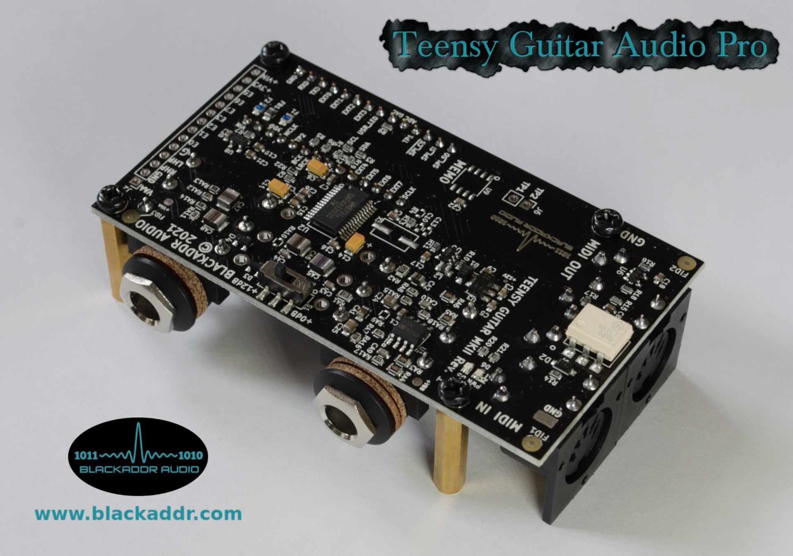
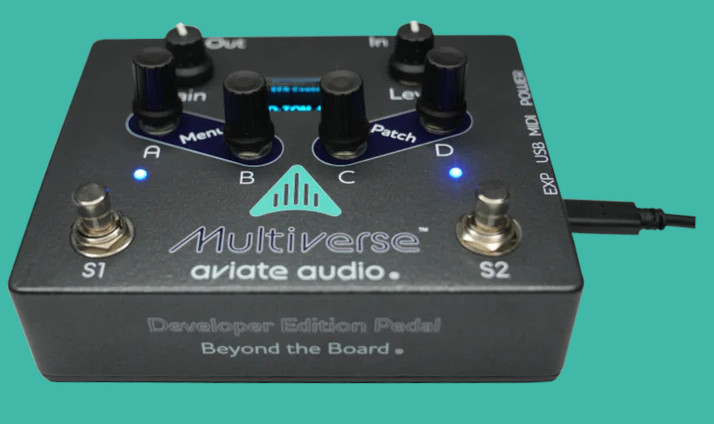

## BALibrary
This library was lasted tested and updated in Feb. 2025.

Last tested with:
Arduino IDE: v2.3.4
Teensyduino: v1.59

*TGA PRO MKII by Blackaddr Audio*

*Aviate Audio Multiverse - Developer Edition*

**INTRODUCTION**
This open-source library is designed to extend the capabilities of Teensyduino, a collection of Arudino libraries  ported to the Teensy microcontroller platform by Paul at PJRC.com.

Teensyduino provides a realtime Audio library that makes it very easy for musicians and audio enthusiasts to start experimenting with and writing their own audio processors and effects, without the need for a lot of programming experience. This is accomplished by handling the complex topics (like using DMA to move audio blocks around) so you can focus on how you want to process the audio content itself.

BALibrary adds to this by providing features and building blocks that are of particular interest to guitarists. In a nutshell, guitarists want digital audio to work similar to their guitar pedals and amps. Basically, a chain of self-contained audio processors with switches and knobs to control them. The good news is we can do this digitally with virtual patch cables (called AudioConnections) and MIDI control.

**INSTALLATION**
In order to use BALibrary, you should:

 1. Install the Arduino IDE. This is where you write and compile your software, called 'sketches'. See [here](https://www.arduino.cc/en/software).
 2. Install the Teensyduino plugin for the Arduino IDE. This provides support for programming Teensy boards over USB, as well as access to the plethora of helpful libraries and examples it provides. See [here](https://www.pjrc.com/teensy/td_download.html).
 3. Download the BALibrary library, and use the Library Manager in the Arduino IDE to install it. See [here](https://www.arduino.cc/en/Guide/Libraries) for details..
 4. In your .ino sketch, include "BALibrary.h" for access to general purpose classes.
 5. In your .ino sketch, include "BAEffects.h" for access to Blackaddr Audio custom audio effect classes.
 6. In your the begining of your setup() functions, call the macro set your hardware model. E.g. TGA_PRO_MKII_REV1(), MULTIVERSE_REV1(), etc.

**HARDWARE**
The audio primitives and effects provided in the BALibrary library require no special hardware other than a Teensy 3.x or Teensy 4.x series board. However, in order to use the external RAM features provided in some effects, the SPI pins used must be the same as those used on the Blackaddr [TGA-Pro audio shield](http://blackaddr.com/products/).

*** TGA PRO ***
This library was originally designed as a companion to the TGA Pro series of hardware boards. These boards expand Teensy by adding the necessary analog audio, preamp and MIDI circuitry needed to make guitar effects, MIDI synths, etc.

*** Aviate Audio Multiverse ***
This library also supports the Aviate Audio Multiverse (based upon the Teensy MicroMod) which means in addition to the amazing guitar effects ecosystem it provides, you can also program it yourself just like any other Teensy! So, this library also includes pinout support this device. A simple demo is provided that exercises all the hardware features of this platform. See examples/Tests/Multiverse_BasicDemo. Please note this demo requires the installation of a few additional
libraries. See the demo source code for more details.

**BALibrary CONTENTS**
 - WM871 advanced codec control
 - external SPI SRAM manager with DMA support
 - pinout support for all TGA Pro models, plus Aviate Audio Multiverse
 - some example effects using the library
 - more on the way!

